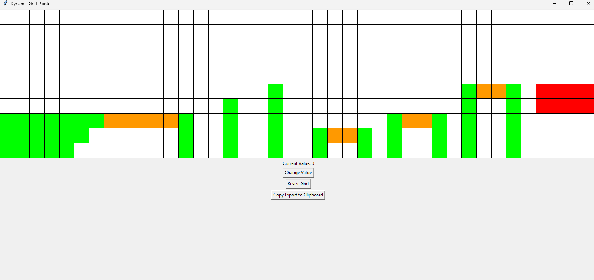

# Grid-Painter
A basic Python tool which makes it easier to make tilemaps!  
Just run the python file gridpainter.py 

**How To Use**:
* Load your tileset with the load button,
* Click on the asset you want to paint with,
* Click and drag across the grid to paint with that tile, 
* Press "Resize Grid" to change number of rows and columns, 
* Click export to clipboard to get it conveniently formatted as a comma seperated list of textures! 
  

